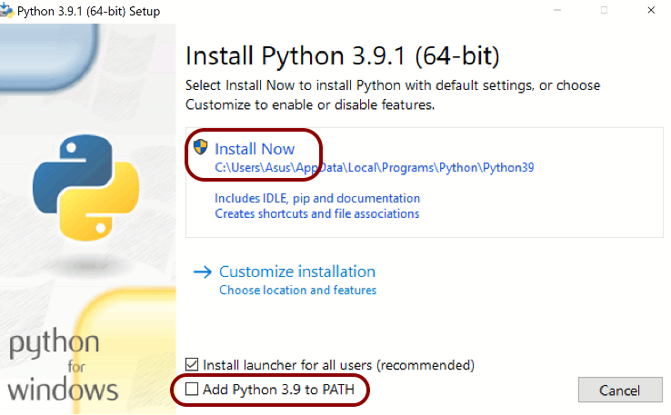

# การติดตั้งคอมพิวเตอร์
การติดตั้งซอฟต์แวร์ที่จะเป็นในการทดสอบและรันโปรแกรม
ไอโอที มีขั้นตอนอยู่ 3 ขั้นตอน คือ 

1. ติดตั้ง git
2. ติดตั้ง python
3. ติดตั้ง platformio

## 1. การติดตั้ง git

git (อ่านว่า กิท)
เป็นซอฟต์แวร์ ที่โปรแกรมเมอร์ทั่วโลกใช้ในการเก็บโปรแกรม
เป็นเครื่องมือในการเผยแพร่โปรแกรม
เป็นเครื่องมือในการช่วยกันแก้ไขปรับปรุงโปรแกรม
เป็นเครื่องมือในการดาวน์โหลดโปรแกรมและไฟล์
เป็นเครื่องมือด้านการพัฒนาซอฟต์แวร์ที่ถูกใช้มากที่สุด

### 1.1 ดาวน์โหลด ซอฟต์แวร์ git จากเว็บไซต์ของ git
ให้เปิดบราวเซอร์ ไปที่เว็บไซต์

<https://git-scm.com/download/win>

ถ้าคอมพิวเตอร์ที่ใช้เป็น 32 บิตให้โหลด
32-bit Git for Windows Setup.

ถ้าคอมพิวเตอร์ที่ใช้เป็น 64 บิต ให้โหลด
64-bit Git for Windows Setup.

### 1.2 รันโปรแกรมเพื่อติดตั้ง git

หลังจากได้โหลดโปรแกรมมาแล้ว ให้รันโปรแกรมนั้นโดยการ
ดับเบิ้ลคลิก บนโปรแกรมที่โหลดมา

### 1.3 ทดสอบผลการติดตั้ง ว่าสำเร็จพร้อมใช้หรือไม่

เปิดโปรแกรม Command Prompt
จะได้ หน้าต่างสีดำ  ให้คลิกไปที่หน้าต่างนั้น
แล้วใช้แป้นพิมพ์ พิมพ์ข้อความต่อไปนี้แล้วตางด้วย enter
เพื่อทดสอบว่า git พร้อมใช้หรือไม่

```
git
```
ถ้าไม่พร้อมใช้จะปรากฎข้อความ
```
'git' is not recognized...
```
ถ้าพร้อมใช้งานจะมีข้อความอธิบาย คำสั่งและวิธีใช้
```
....
```

## 2. การติดตั้ง python

python เป็นภาษาคอมพิวเตอร์
เป็นภาษาที่เรียนรู้ได้ง่าย ใช้เวลาน้อย
เป็นภาษาเปิด ไม่มีลิขสิทธิ์ คิดค้นและพัฒนาโดยองค์กรกลาง
และสามารถใช้งานได้ทันที
เป็นภาษาที่ได้รับความนิยมสูงมาก
ถูกใช้เป็นตัวกลางในการติดตั้งซอฟต์แวร์จำนวนมาก
อาทิเช่น 
ซอฟต์แวร์ทำเว็บไซต์
ซอฟต์แวร์ทางคณิตศาสตร์
ซอฟต์แวร์ปัญญาประดิษฐ์ หรือ AI
ซอฟต์แวร์ทางวิทยาศาสตร์ เป็นต้น
ในที่ Python ถูกใช้เป็นตัวกลางในการติดตั้งซอฟต์วแวร์
platformio เพื่อใช้ในพัฒนา ไอโอที

### 2.1 ดาวน์โหลด โปรแกรม จาก เว็บไซต์

<https://www.python.org/downloads/windows/>

โดยเลือกเวอร์ชั่นที่เหมาะสม
ถ้าเป็น Windows 10 ขึ้นไปควร เลือก เวอร์ชั่นล่าสุด

ถ้าเป็น Windows 7 ขึ้นเลือก เวอร์ชั่น 3.8

ถ้าคอมพิวเตอร์ที่ใช้เป็น 32 บิท ควรเลือกเวอร์ชั่น 32 บิท

ถ้าคอมพิวเตอร์ที่ใช้เป็น 64 บิท ควรเลือกเวอร์ชั่น 64 บิท

### 2.2 เมื่อดาวน์โหลดมาแล้ว ให้รันโปรแกรมติดตั้ง python

รันโปรแกรมที่ดาวน์โหลดมา โดยดับเบิลคลิก บนโปรแกรมนั้น
ในหน้าจอแรกของการติดตั้ง ถ้ามีให้เลือก 
'Add Python to Path' ให้เลือกเช็คด้วย



ทำการติดตั้งโปรแกรม python

### 2.3 ตรวจสอบความพร้อมใช้เมื่อติดตั้งเสร็จสิ้น

เมื่อติดตั้งเสร็จแล้ว ให้เปิด Command Prompt ใหม่

ถ้าเดิมมีเปิดอยู่แล้ว ให้ปิดหน้าต่างเดิมก่อน

ให้รันคำสั่ง  ดังนี้
```
pip
```

ถ้าติดตั้งสำเร็จ จะปรากฎข้อความประมาณนี้
```
...
```

ถ้าติดตั้งไม่สำเร็จ จะมีปรากฎข้อมูลประมาณนี้
```
'pip' is not recognized....
```

## 3. การติดตั้ง platformio

เปิด Command Prompt ใหม่
แล้ว รันคำสั่งดังต่อไปนี้

```
pip install -U platformio
```

รันคำสั่งต่อไปนี้
```
pio
```

ถ้ารันสำเร็จจะมีข้อความอธิบายวิธีใช้
```
...
```

ถ้าไม่สำเร็จ จะมีปรากฎข้อความประมาณนี้
```
'pio' is not recognized....
```

